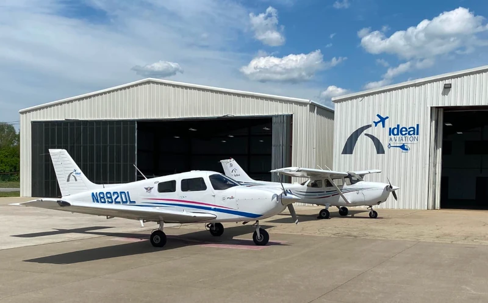

Learning to fly is an exciting and rewarding experience. It's a chance to explore the world from a new perspective and to gain a new sense of freedom. However, it can also be expensive and time consuming if done incorrectly. That's why it's important to make the most of every flight lesson. Here are 5 tips that you can use to make the most of each lesson and make your flight training the most fun, efficient, and safe.

## 1. Do your homework

Before your flight lesson, take some time to review the lesson objectives and any relevant materials. This will help you to understand what you're going to be learning and how you can best prepare. Ask your instructor for reading materials and content to digest so that way when you walk into your next flight lesson, you know what to expect and can do a great job.

Here are some specific things you can do to prepare for your flight lesson:

- Read the lesson objectives and materials carefully.
- Review the aircraft's checklists and procedures.
- Watch videos or read articles about the topics you'll be learning.
- Ask your instructor any questions you have.

## 2. Be Prepared

Make sure you arrive at the airport on time and that you have all of the necessary paperwork and equipment. This will help to ensure that your lesson gets off to a smooth start.

Here are some specific things you need to bring to your flight lesson:

- Your student pilot certificate
- Your logbook
- A pen or pencil
- A headset
- Sunglasses
- Sunscreen
- Comfortable clothing

Similar to the first point, come into the flight lesson with an objective in mind. Don't rely on your CFI to do all the work for you. Review the syllabus, know what you're about to get into, and prepare ahead of time.

## 3. Ask Questions

Don't be afraid to ask your instructor questions if you don't understand something. The more you understand, the more you'll be able to retain and the more you'll get out of your lesson.

Here are some tips for asking questions:

- Be specific. Don't just ask "I don't understand." Instead, ask "What does this term mean?" or "Why do we do it this way?"
- Be respectful. Don't interrupt your instructor or ask questions that are not relevant to the lesson.
- Be patient. Your instructor may not be able to answer your question right away.

## 4. Pay attention.

This may seem like a no brainer, but it's important to pay attention during your flight lesson. This is your chance to learn from an experienced pilot, so make the most of it.

Here are some tips for paying attention:

- Sit up straight and make eye contact with your instructor.
- Take notes.
- Ask questions if you don't understand something.
- Be aware of your surroundings.

## 5. Practice

Once you've learned something new, practice it at home. This will help you to solidify your understanding and make it easier to remember when you're in the air. Try using a simulator or try chair flying. If you don't know what chair flying is, it's the act of visualization but for pilots. Try sitting down in a chair at home. Close your eyes and imagine being in the cockput. Run through checklists, flows, and practice the same physical movements that you would do when in the air. Adjust the throttle, play with the trim, look left and right, practice using your legs to control the rudder.

Here are some more ways you can practice at home:

- Read the lesson materials again.
- Watch videos or read articles about the topics you've learned.
- Use a flight simulator.
- Talk to other pilots about their experiences.

## Are You Flying at Ideal Aviation Yet?

If you're interested in learning to fly, we encourage you to reach out to the team at Ideal Aviation. We offer a variety of flight training programs to fit your needs and budget. With the help of the team at Ideal Aviation, you can achieve your dream of becoming a pilot.

### Contact Ideal Aviation today to learn more about their flight training programs!
