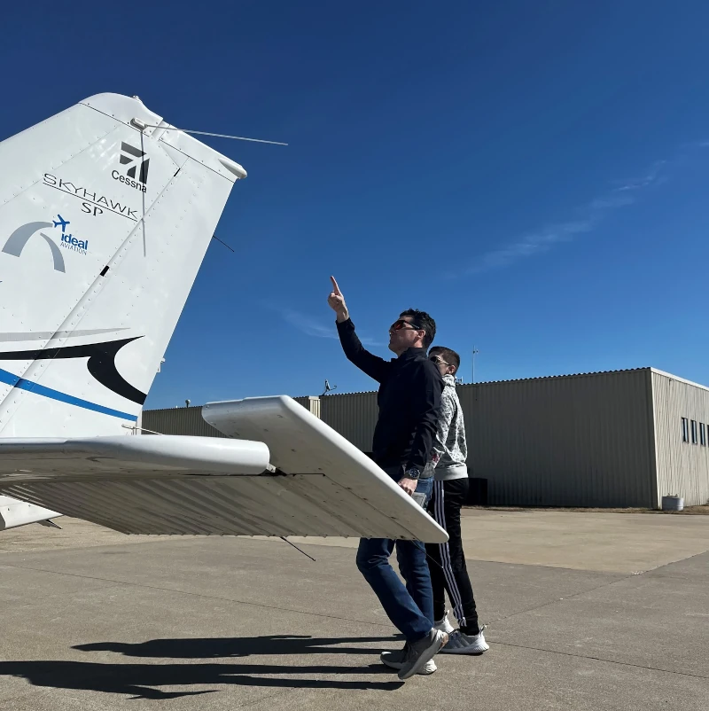
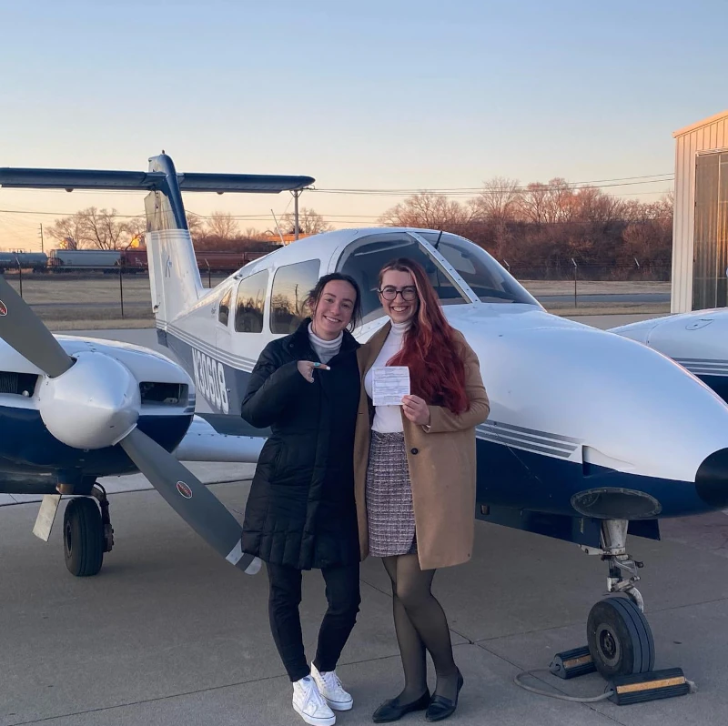

The thought of flying through the skies as a licensed pilot is an exhilarating one. However, before you can spread your wings, there's an essential milestone to conquer – the FAA written exam. At Ideal Aviation, nestled right at the St. Louis Downtown Airport in Sauget, Illinois, we understand the weight of this challenge and are dedicated to equipping our students with the tools they need to face it head-on.

## Understanding the FAA Written Exam

The FAA written exam for private pilots is no walk in the park. It's a comprehensive assessment that delves into the intricate world of aviation, testing your knowledge of airspace classifications, regulations, navigation techniques, flight operations, weather patterns, and aeronautical decision-making. With a barrage of multiple-choice questions, this exam demands a deep understanding of the subject matter and the ability to apply that knowledge in real-world scenarios.

_Before you fly solo, you'll need to pass your written exam_

## Effective Strategies for Exam Preparation

At Ideal Aviation, we believe in a multi-faceted approach to exam preparation. Our methods are tailored to ensure that you not only grasp the theoretical concepts but also develop a practical understanding of how they translate into the cockpit.

1. Focused Study Sessions: Organize regular study sessions that break down the exam content into manageable segments. Our instructors can help walk you through a topic too, ensuring a thorough review of all the necessary material.
2. Using Visual Aids: With the St. Louis Downtown Airport as our backyard, we have a unique advantage – the ability to incorporate real-world visuals and scenarios into our learning process. From observing aircraft movements to studying weather patterns, we bring the theoretical knowledge to life, enhancing your practical understanding.
3. Practice Tests: Familiarity breeds confidence, which is why taking practice tests can be a key to this process. These tests not only help you identify areas where you need further clarification but also prepare you for the pressure of the real exam environment.
4. Expert Guidance: Our experienced instructors are intimately familiar with the nuances of flying in the St. Louis region. They provide invaluable insights, tips, and real-world examples that can make all the difference in your exam performance.

## Day of the Exam Tips

As the big day approaches, we equip you with essential tips to ensure you're in top form:

- Arrive well-rested and early to the exam center, avoiding any last-minute stress that could cloud your focus.
- Read each question carefully, as some may be designed to test your attention to detail.
- Manage your time effectively, allocating enough time to review your answers thoroughly before submission.

_Once you pass the written, you can start working on more complex ratings!_

At Ideal Aviation, your success in the FAA written exam is our top priority. We take pride in our dedicated approach to pilot training, tailored specifically to the aviation conditions and regulations in the St. Louis area. Our goal is not just to help you pass the exam but to transform you into a proficient and knowledgeable pilot, capable of navigating the skies with confidence and skill.

## Next Steps

Are you ready to take the next step in your pilot training journey? Visit Ideal Aviation at the St. Louis Downtown Airport and discover how our targeted preparatory courses can set you up for success on the FAA written exam and beyond. Join us and soar high with the skills and confidence gained from St. Louis's premier flight school.
