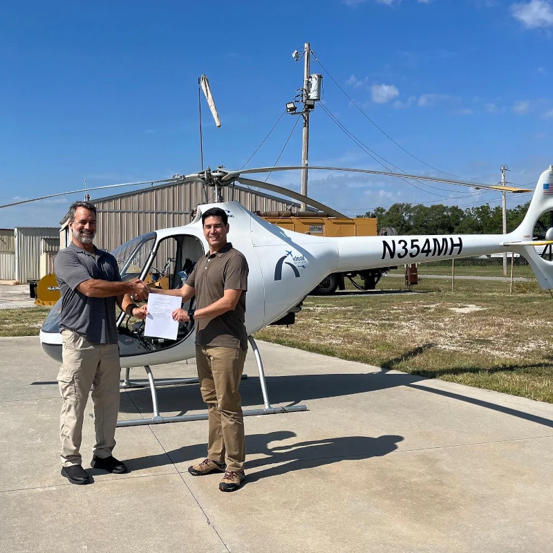

Becoming a pilot is a worthy endeavor that requires careful consideration when selecting the right flight school. If you're looking to kickstart your flight career or pursue a lifelong passion for flying, choosing the ideal flight school is paramount. Let's delve into the factors you should weigh when considering how to choose a flight school:

## Location and Accessibility

Location plays a pivotal role in your flight training experience. Opting for a flight school situated in a convenient location not only saves you commuting time but also ensures you can maximize your time in the air. Furthermore, flight school is a time commitment across multiple weekdays. The further you are from the flight school, the less motivated you might be to attend a training session.

Ideal Aviation Flight School's prime location at the Downtown St. Louis Airport provides easy access for aspiring pilots, offering a seamless transition from ground to sky. We support students from all over the St. Louis area. With our proximity to major highways and transportation hubs, reaching our facilities is a breeze, allowing you to focus on honing your piloting skills without the hassle of long commutes.

_Come see St. Louis from our perspective_

## Safety Measures and Reputation

Safety is non-negotiable in aviation. Before committing to a flight school, scrutinize their safety measures and reputation within the aviation community. Ideal Aviation Flight School prides itself on upholding the highest safety standards, with a stellar reputation for maintaining a stringent safety protocol. Our team of experienced instructors undergo rigorous training and recurrent evaluations to ensure adherence to safety protocols, fostering a culture of safety consciousness among all students and staff. Rest assured, your safety is paramount here.

## Training Programs and Certifications Offered

When evaluating flight schools, assess the diversity of training programs and certifications they offer. Ideal Aviation Flight School boasts a range of training programs tailored to suit pilots of all levels, from beginner enthusiasts to seasoned professionals. We are Part 61 and 141 certified, meaning we have certain benefits for military students where others don’t. Whether you aspire to earn your private pilot license or pursue advanced certifications, our tailored programs cater to your aviation aspirations.

As of today, we offer helicopter, rotary-wing, airline, and fixed-wing programs. Ratings range from Private License, Instrument, Commercial License, Multi Engine, and CFI. With a curriculum designed to align with FAA regulations and industry best practices, you'll receive top-notch training that equips you with the skills and knowledge needed to excel in your aviation journey.

_There is a training program for everyone here at Ideal Aviation - come train with us today!_

## History and Dedication

Past successes define a flight school. Ideal Aviation's legacy is deeply rooted in the Macon family's aviation heritage, led by Bill Macon. Acquiring the school in 2011, Bill's passion for flying seamlessly merged with his entrepreneurial drive, propelling Ideal Aviation's growth. With personal achievements including private, instrument, and multi-engine ratings, Bill embodies the perfect blend of work and pleasure in aviation.

Today, Ideal Aviation spans three hangars at the St. Louis Downtown Airport, boasting a team of over 15 flight instructors and a diverse fleet of 10 aircraft. The school's commitment to excellence and innovation, guided by the Macon family legacy, ensures unparalleled training and support for present and future pilots.

## Quality of Instructors and Mentorship

The caliber of instructors and mentorship provided by a flight school significantly influences your learning journey. At Ideal Aviation Flight School, our team of seasoned instructors comprises industry experts who are passionate about imparting their wealth of knowledge and expertise. With years of experience both in the cockpit and in the classroom, our instructors serve as mentors, guiding you through every step of your aviation education journey. Benefit from personalized mentorship and guidance as you embark on your quest to master the skies, forging lasting connections with mentors who are invested in your success.

## Come By Today

Naturally, the decision of which flight school is best for you is a personal one. However, we’d be pleased if your choice was to fly with us. Ideal Aviation is poised to welcome you to our family if flight training is of interest to you. Please give us a call today!
