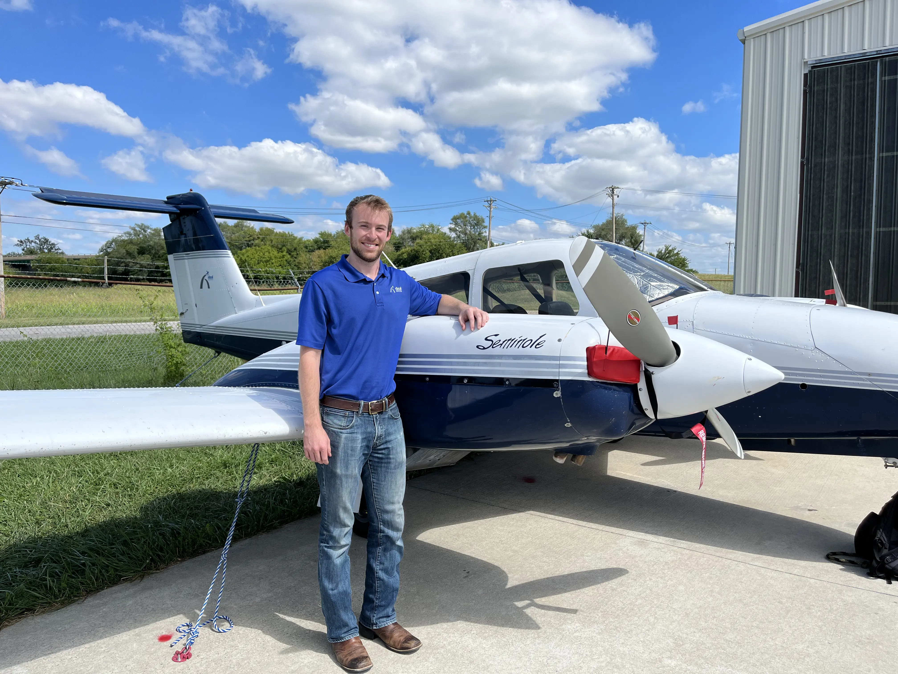
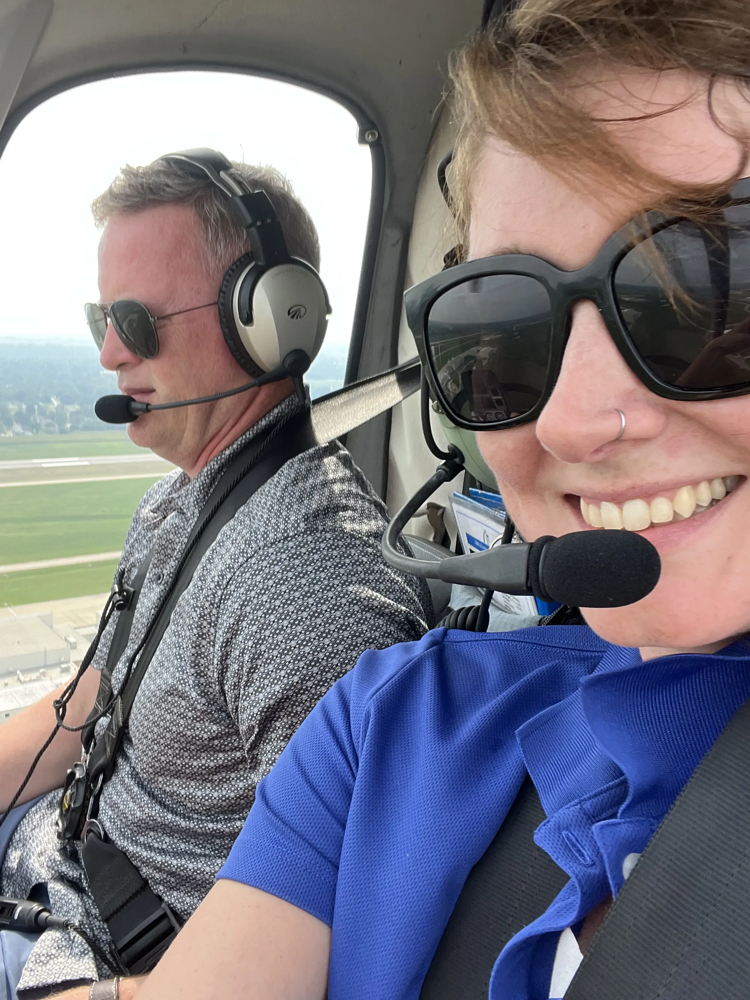

When aspiring pilots embark on their journey to conquer the skies, they are often faced with a crucial decision: should they pursue training for helicopter (rotary-wing) flight or airplane (fixed-wing) flight? Both paths lead to the exhilarating experience of flying, but the training processes, skills required, and career opportunities can differ significantly. At Ideal Aviation, we offer comprehensive training programs for both helicopter and airplane pilots, helping you make an informed decision and achieve your aviation goals.

## Initial Training: Helicopter vs. Airplane

The initial stages of flight training for both helicopters and airplanes cover the basic principles of flight, aviation regulations, and air traffic control procedures. However, the practical aspects of learning to fly these aircraft diverge early in the process.

For airplane training, students start with mastering the basics of fixed-wing flight, including straight-and-level flight, turns, climbs, and descents. The emphasis is on developing a feel for the aircraft's control surfaces – the ailerons, elevators, and rudder – and understanding how these surfaces influence the airplane's movement in the air.

Helicopter training, in contrast, begins with understanding the complexities of rotary-wing flight. Students must quickly grasp the concept of rotor dynamics, including how the main rotor blades generate lift and how changes in pitch affect the helicopter's altitude and direction. Hovering is a fundamental skill unique to helicopters and requires precise coordination of the collective, cyclic, and anti-torque pedals to maintain a stable position.

_Come visit our fleet today at the St. Louis-Downtown Airport_

### Advanced Maneuvers and Emergency Procedures

As students progress, the training for helicopters and airplanes becomes more specialized. For airplane pilots, advanced training includes cross-country navigation, instrument flying, and handling emergency procedures such as engine failures and forced landings. These skills are crucial for obtaining an instrument rating and commercial pilot license, which open the door to professional aviation careers.

Helicopter training, on the other hand, places a strong emphasis on mastering autorotations – a critical emergency procedure where the helicopter descends safely without engine power. Students also learn advanced maneuvers such as confined area operations, external load operations, and low-level flight. These skills are essential for specialized roles in helicopter operations, such as search and rescue, aerial firefighting, and medical evacuations.

### Instrument Training: Navigating Without Visual References

Instrument training is an integral part of both helicopter and airplane flight training, enabling pilots to fly safely in low visibility conditions. However, the approaches to instrument training can vary between the two.

For airplane pilots, instrument training involves extensive practice with flight instruments and navigation systems, focusing on procedures for takeoff, enroute navigation, approach, and landing under instrument flight rules (IFR). The goal is to develop proficiency in flying solely by reference to instruments, without relying on outside visual cues.

Helicopter instrument training covers similar ground but often includes additional challenges due to the helicopter's ability to hover and perform vertical takeoffs and landings. Helicopter pilots must learn to manage the unique dynamics of rotary-wing flight while maintaining precise control and situational awareness in IFR conditions.

_Flying over Missouri!_

### Career Opportunities and Pathways

Both helicopter and airplane pilots have a wide range of career opportunities, but the pathways can differ based on the type of aircraft they are trained to fly.

For airplane pilots, career options include becoming airline pilots, corporate pilots, flight instructors, and cargo pilots. The demand for airline pilots is particularly strong, driven by the growth of commercial aviation and the need for replacements due to retirements. Obtaining an Airline Transport Pilot (ATP) certificate is often the ultimate goal for aspiring airline pilots, requiring extensive flight hours and advanced training.

Helicopter pilots, meanwhile, find opportunities in diverse sectors such as emergency medical services (EMS), law enforcement, offshore oil and gas support, and tourism. The versatility of helicopters makes them indispensable in roles that require maneuverability and the ability to operate in challenging environments. Helicopter pilots often pursue specialized certifications and endorsements to qualify for these roles, such as the Helicopter Emergency Medical Services (HEMS) endorsement.

## Choosing the Aircraft Path for You

Deciding between helicopter and airplane flight training ultimately comes down to your personal interests, career goals, and the type of flying experience you seek. Both paths offer unique challenges and rewards, and understanding the differences can help you make an informed decision.

At Ideal Aviation, we are dedicated to providing top-notch training programs for both helicopter and airplane pilots. Our experienced instructors, state-of-the-art facilities, and commitment to safety ensure that you receive the best possible training to achieve your aviation dreams.

Ready to take the next step? Visit our school today to learn more about our training programs, schedule a discovery flight, or contact us for more information. Whether you choose to soar in an airplane or hover in a helicopter, Ideal Aviation is here to guide you every step of the way. Start your aviation journey with us today and discover the sky's the limit.
