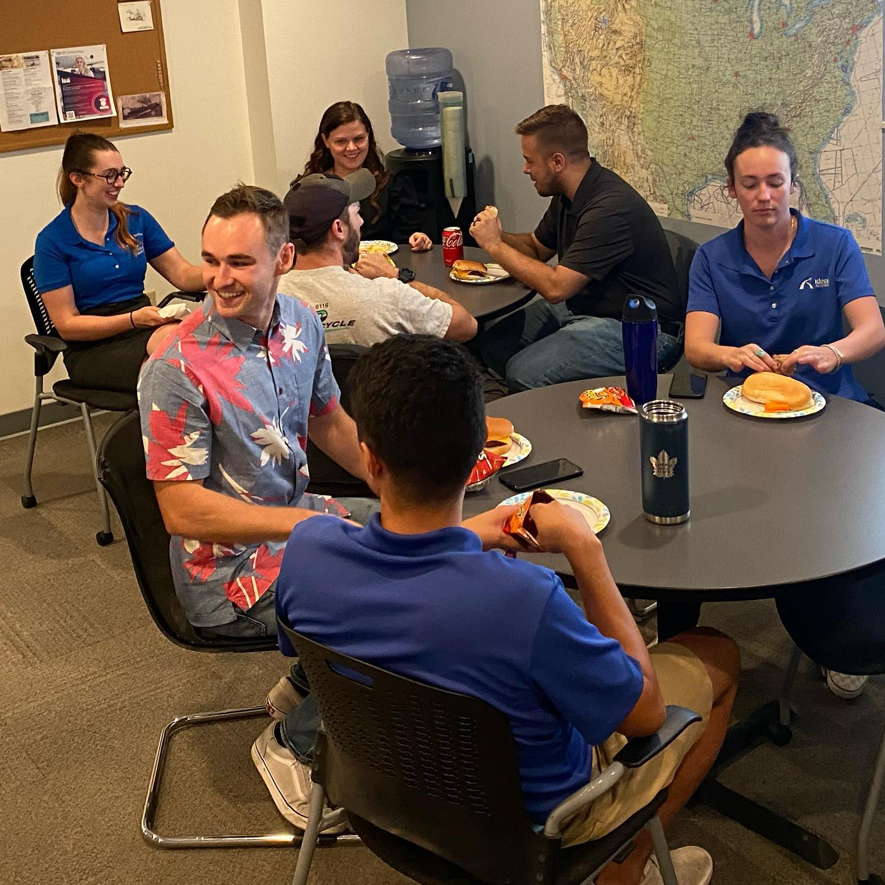
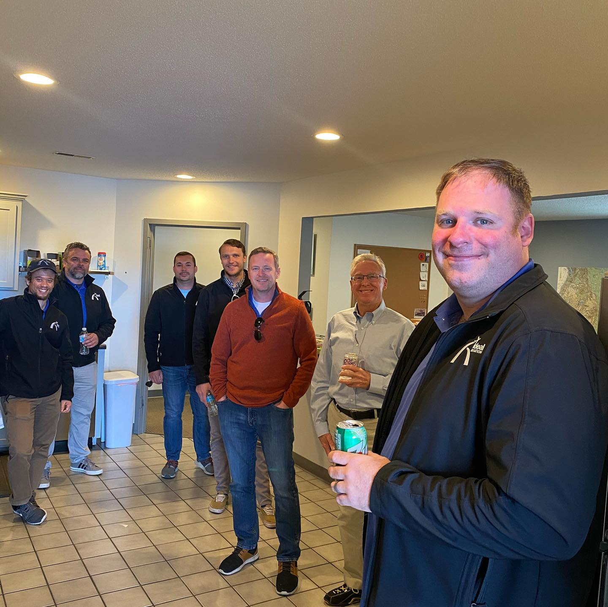
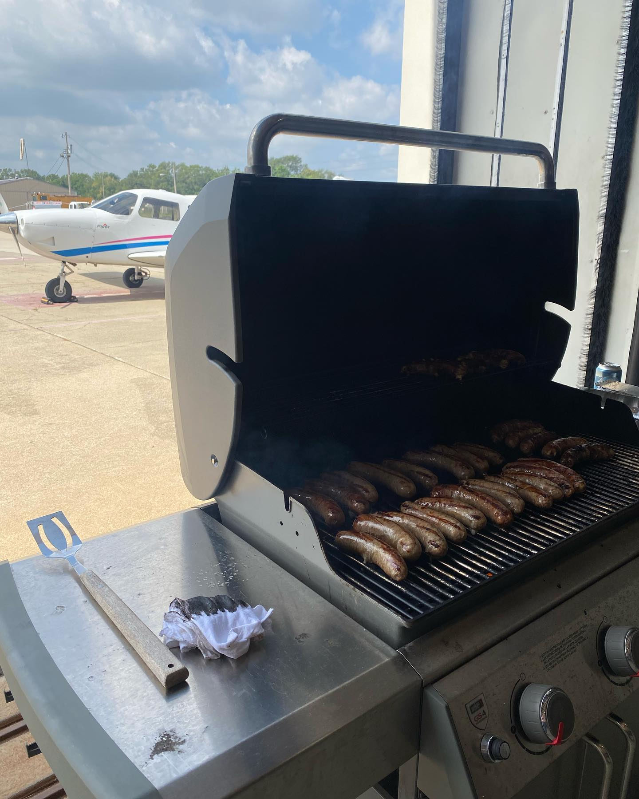

At Ideal Aviation, we believe that the best way to become a successful pilot is to learn from and support each other. That's why we create a community oriented environment where students can collaborate, share knowledge, and build lasting friendships.

Here are just a few of the benefits of attending a community oriented flight school:

- Increased success: Studies have shown that students who work together are more likely to succeed than those who compete against each other. This is because teamwork helps to build confidence, communication skills, and problem-solving abilities. For example, one study by the University of Chicago found that students who worked in teams on group projects were more likely to get A's than those who worked alone. Another study by the University of California, Los Angeles found that students who had strong social support networks were more likely to persist in their studies and graduate. Being a part of the community helps build lifelong friendships that will support and foster you along the way.
  

- Enhanced job prospects: The aviation industry is a small world, and having a strong network of contacts can give you a leg up when it comes to finding a job. By making friends at Ideal Aviation, you'll be able to connect with other pilots and industry professionals who can help you advance your career. You never know where that safety pilot you flew with and built time with will end up. There are countless student pilots who have moved on from Ideal Aviation and are now in the airlines.

- Improved pilot performance: Pilots who have strong teamwork skills are better able to handle the challenges of flying. They are also more likely to make sound decisions in stressful situations. Making friends at Ideal Aviation and then flying with them gives you a chance to practice CRM (crew resource management) before you go into the airlines or start your pilot career.

- Lifelong friendships: The friendships you make at flight school can last a lifetime. After all, you'll be sharing unique experiences that will bond you together forever.
  

- Find a mentor: A mentor can provide you with guidance and support throughout your training. A mentor might not necessarily be your CFI, but rather a pilot who may have gone through similar experiences as you and are further along in their training and pilot career. They can help you set goals, talk to you about their experiences and what to expect, develop your skills, and navigate the challenges of becoming a pilot. When looking for a mentor, it's important to find someone who is experienced and knowledgeable in the aviation industry. They should also be someone who you can trust and who you feel comfortable talking to.

- Taking care of your mental and physical health: Becoming a pilot is a demanding career, so it's important to take care of your mental and physical health. Make sure to get enough sleep, eat healthy foods, and exercise regularly. You should also find ways to manage stress, such as meditation or yoga.
  

- The challenges and rewards of becoming a pilot: Becoming a pilot is a challenging but rewarding journey. The challenges include the long hours of training, the high cost of tuition, and the competitive job market. However, the rewards are also great, including the satisfaction of flying, the opportunity to travel the world, and the chance to make a difference in people's lives.

If you're looking for a flight school that will help you achieve your aviation dreams, Ideal Aviation is the place for you. We offer a supportive and collaborative environment where you can learn from and support each other. [Contact us today](https://idealaviationstl.com/contact) to learn more about our programs.
