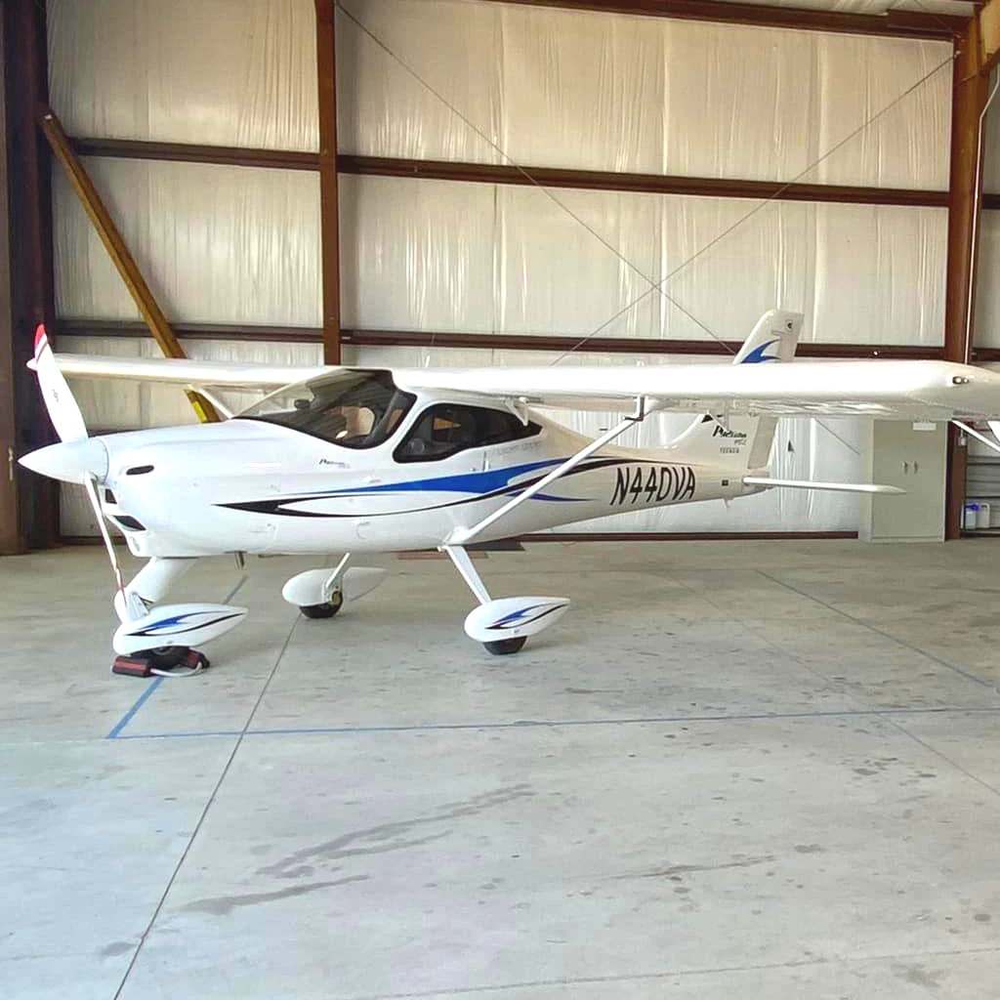
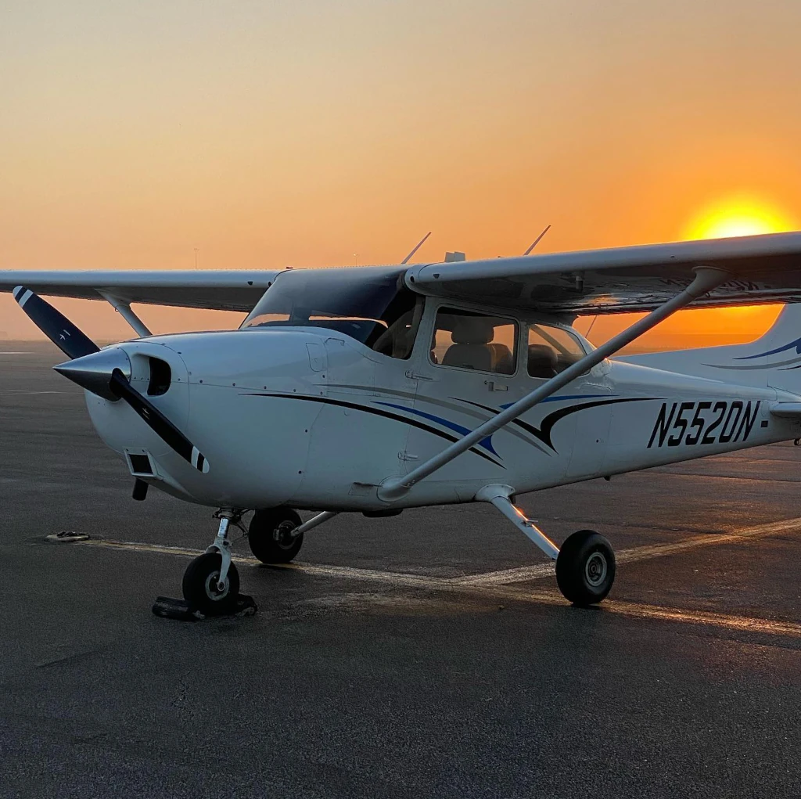
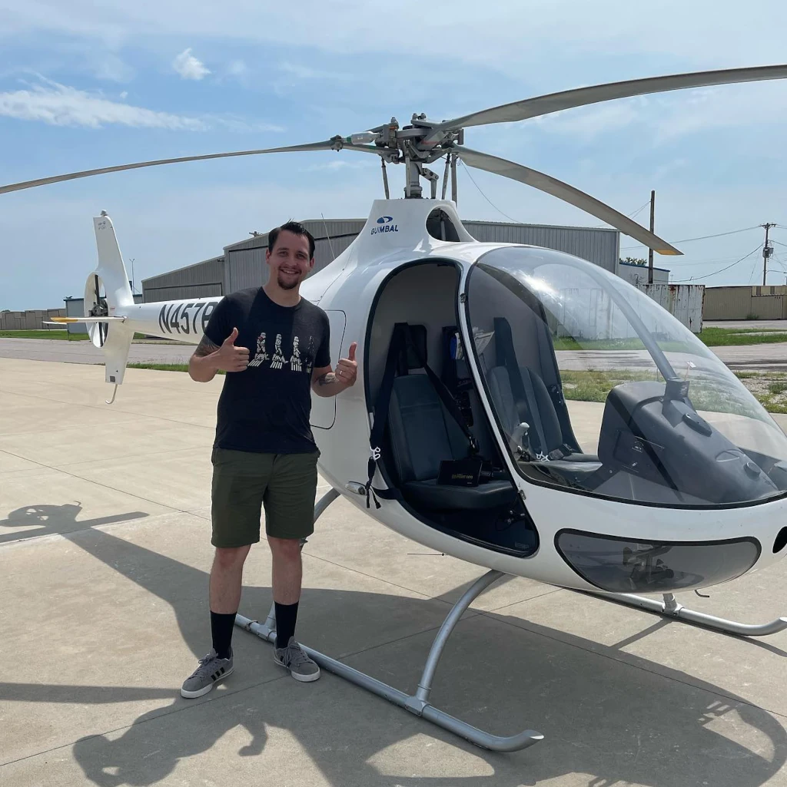

At Ideal Aviation, students have access to a wide variety of aircraft, ensuring that their training meets the highest standards. From fixed-wing airplanes to rotary-wing helicopters, each aircraft in the fleet plays a crucial role in developing the skills needed for different certifications, including Private Pilot License (PPL), Commercial Pilot License (CPL), Certified Flight Instructor (CFI), and more.

## Fixed-Wing Fleet

Ideal Aviation’s fixed-wing aircraft are perfect for students pursuing traditional airplane pilot certifications. The fleet is designed to accommodate both beginner and advanced pilots, with aircraft that provide reliability, modern avionics, and comprehensive training capabilities.

### Tecnam P92

- Role: Light Sport Aircraft (LSA) training
- Purpose: The Tecnam P92 is the only aircraft of its kind offered for flight training in the St. Louis area. Equipped with the Garmin G3X touch screen avionics system, it provides a modern, safe, and highly responsive training experience for new pilots. Its advanced avionics and comfortable cabin make it ideal for Light Sport Pilot License (LSA) training. The Tecnam offers an enjoyable and accessible way to enter the world of aviation, while its sleek design and ease of use allow students to develop confidence in flight early in their training.

_Ideal Aviation’s Tecnam aircraft, used for various training programs_

### Piper Pilot 100i

- Role: IFR trainer and cross-country flights
- Purpose: The Piper Pilot 100i is a modern and highly reliable aircraft, perfect for Instrument Flight Rules (IFR) training and cross-country flights. Its Garmin G3X touch screen suite and advanced autopilot system make it a popular choice for students looking to gain proficiency in more complex navigation and flying conditions. With its Lycoming 180 horsepower engine, the 100i is capable of handling both short hops and long-distance trips, providing flexibility in training scenarios.

### Cessna 172

- Role: Primary flight trainer
- Purpose: The Cessna 172 has long been the go-to training aircraft worldwide, and Ideal Aviation is no exception. Known for its reliability and versatility, the Cessna 172 is perfect for Private Pilot License (PPL) students. It’s a forgiving aircraft for new pilots, while still offering enough power and features to train advanced students. The fuel-injected Continental IO-360 engine provides plenty of power for takeoffs, climbs, and cruising, making the Cessna 172 ideal for various training missions.

_The Cessna 172, a versatile training aircraft, at Ideal Aviation during sunrise_

### Piper Seminole

- Role: Multi-engine flight training
- Purpose: The Piper Seminole is Ideal Aviation’s multi-engine aircraft, used primarily for Commercial Pilot License (CPL) and Multi-Engine Rating training. Equipped with dual Lycoming fuel-injected engines and Garmin avionics, the Seminole provides students with the necessary experience to operate twin-engine aircraft in a range of conditions. The G5 avionics suite offers seamless navigation, making it easier for students to focus on mastering the complexities of multi-engine flight.

## Rotary-Wing Fleet

Ideal Aviation’s rotary-wing fleet is designed for those pursuing helicopter certifications, from Private to Commercial ratings. These helicopters are ideal for various flight training scenarios, offering stability and advanced avionics to meet the demands of helicopter pilots.

### Guimbal Cabri

- Role: Primary helicopter trainer
- Purpose: The Guimbal Cabri is the safest training helicopter in its class, and Ideal Aviation is the only flight school in St. Louis to offer it. This helicopter is used for Private Helicopter Pilot training, providing students with hands-on experience in a stable and modern aircraft. The Cabri's safety features, including a rigid main rotor system and crash-resistant fuel tank, make it an excellent choice for training. Students also benefit from its spacious cabin and comfortable seating, which create an optimal learning environment.

_The Guimbal Cabri, Ideal Aviation’s choice for rotary wing training_

### Elite Helicopter Simulator

- Role: Advanced helicopter simulation
- Purpose: The Elite Helicopter Simulator provides students with a highly realistic, immersive flight experience. Ideal for Instrument Rating (IR) and advanced maneuver practice, the simulator allows students to safely practice emergency procedures, complex maneuvers, and weather scenarios without the risk associated with actual flight. This tool is invaluable for students who want to sharpen their skills and gain proficiency before taking to the air.

## Why Ideal Aviation’s Fleet Matters for Your Training

Ideal Aviation's diverse fleet allows students to gain experience in a range of aircraft types, preparing them for both fixed-wing and rotary-wing certifications. The modern avionics, safety features, and comfort of the aircraft ensure that every student is well-prepared for both personal and professional aviation careers.

By offering access to cutting-edge aircraft like the Tecnam P92, Piper Pilot 100i, and Guimbal Cabri, Ideal Aviation ensures that students are learning on the best equipment available. Additionally, advanced training devices like the Redbird and Elite Simulators provide students with an opportunity to train in a highly controlled environment, allowing them to practice difficult scenarios without the risk of real-world consequences.

If you’re ready to start your aviation journey, Ideal Aviation has the fleet, instructors, and facilities to get you there. Whether you’re working toward your first license or advancing your skills in a twin-engine aircraft or helicopter, [Ideal Aviation](https://idealaviationstl.com/contact) is here to help you achieve your goals.
