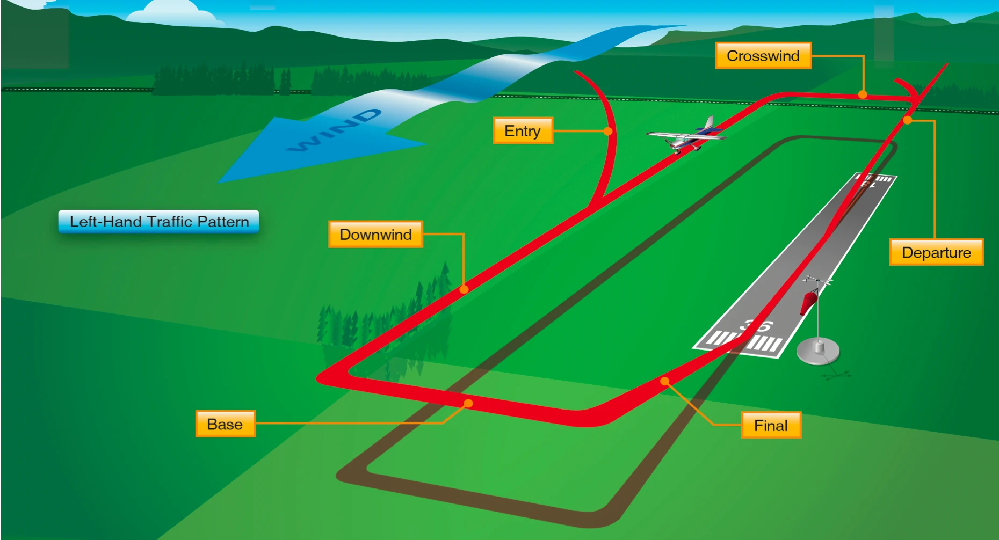

Are you trying to perfect your landing skills? We've got some tips to help you nail those landings like a pro.

## Understand the Traffic Pattern

First things first, make sure you've got a solid understanding of the pattern. The pattern is the specific path that an aircraft follows when approaching an airport for landing. It typically consists of four turns, including the downwind leg, base leg, and final approach. As a student pilot, it's important to understand the pattern and be able to fly it consistently and accurately. This includes maintaining the proper altitude and speed, as well as making a proper downwind entry and base to final turn as you approach the runway.

Establishing a proper downwind sets you up for success. If you're not configured or you are flying too fast or slow in the downwind leg, then that carries over to your base and final legs which then carriers over to your actual landing. Keep your eyes outside the airplane and learn what a good sight picture looks like while confirming what you see outside the plane with your instruments.

_Source: FAA Pilot Handbook of Aeronautical Knowledge_

## Check Your Configuration

Next, pay attention to your configuration. Proper configuration refers to the specific settings and arrangements of an aircraft's flaps, slats, and landing gear. These surfaces affect the lift and drag of the aircraft and are crucial to a successful landing. As you approach the runway, make sure you have your aircraft properly configured for landing, including setting the appropriate flaps for your aircraft and speed.

Speaking about speed, It's very important to maintain the appropriate airspeed. Airspeed is the speed at which an aircraft is moving through the air, and it's crucial to a smooth and safe landing. Too fast and you may struggle to control the aircraft or touch down smoothly. Too slow and you risk entering a stall which has deadly consequences at traffic pattern altitude. Make sure you're maintaining a steady and appropriate approach speed and be prepared to adjust as needed. Remember: "Pitch for speed and power for altitude."

The appropriate airspeed for an aircraft to use during the approach and landing phase of flight will depend on a variety of factors, including the type of aircraft, the weight and balance of the aircraft, the wind conditions, and the length and slope of the runway. In general, a slower approach speed will be used for a steeper approach angle, while a faster approach speed may be used for a shallower approach angle.

For our Cessna 172s and Piper Pilots, a typical approach speed would be around 70 knots, although this may vary depending on the specific conditions and the weight of the aircraft. It's important to note that it's always a good idea to consult the aircraft's pilot's operating handbook (POH) for specific information on recommended approach speeds. The POH will provide detailed information on the appropriate approach speeds for a particular aircraft based on its weight and configuration. Additionally, your instructor will be able to provide guidance on the appropriate approach speeds to use based on the specific conditions of the flight. Discuss with your CFI and get your V Speeds memorized!

## Work With Your CFI and Have Fun

Your CFI will be the best resource for you to understand where your faults are and how to improve. After each flight lesson, ask for candid feedback and how to improve. Take notes and try to apply the lessons learned in each flight lesson on your next. Your CFI wants to see you succeed and be a great pilot.

Finally, practice makes perfect! The more you fly and the more landings you make, the more comfortable and confident you'll become. So don't be afraid to ask your instructor for extra practice sessions or to work on specific landing scenarios. The more you practice, the better you'll get. And as you gain experience, you'll learn how to adapt to different weather conditions, runway lengths, and other variables that can impact your landing.

These were a few simple but important tips to help you land your plane like a pro. Just remember to stay focused, stay calm, and above all, have fun!
