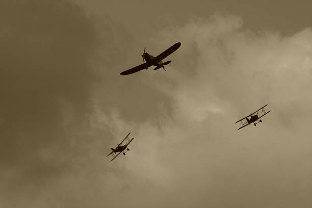
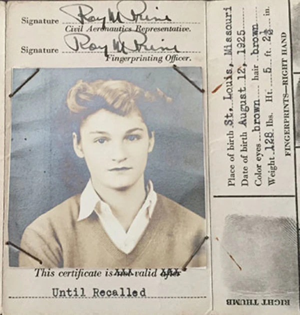
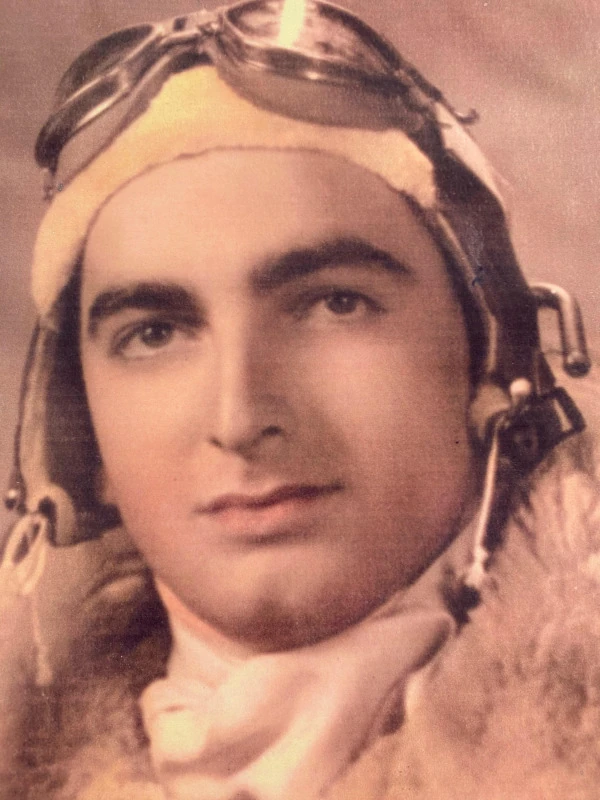
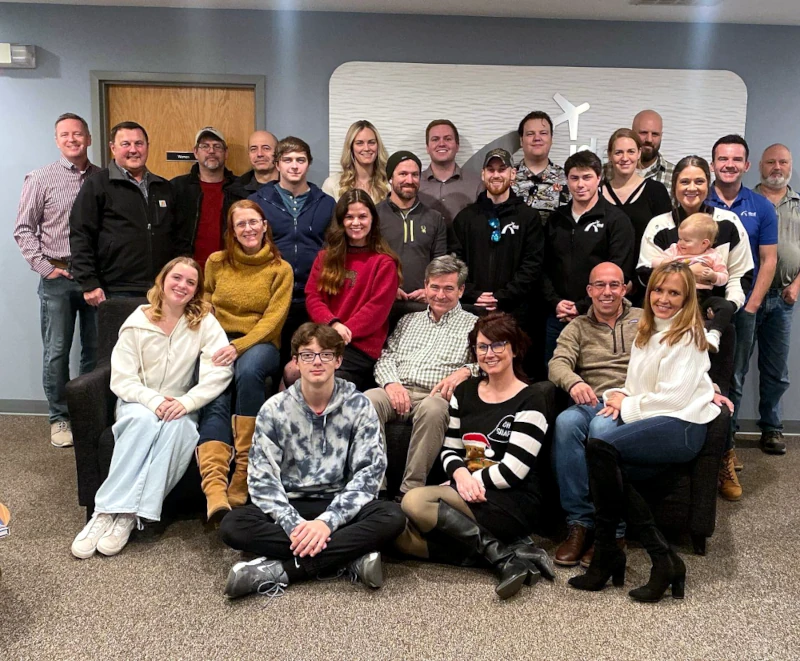

The history of modern flight training holds a rich background. Over years of evolution, innovation, and eventual milestone successes, pilot training has come a long way since the days of the Wright Brothers. Ideal Aviation is proud to be a part of the long-running history of aviation and looks forward to continuing its momentum into 2024. As we look forward to the new year, it is important to look back at how we got here. To do so, we must return to the 1910s…

## Pioneering Roots

Flight training took off with the Wright Brothers, who pioneered airplane invention and laid the foundation for structured aviation education. In 1910, they established one of the first flight schools in Montgomery, Alabama, a legacy that transcended time.

The Montgomery school found its enduring home at Maxwell Air Force Base, becoming a pivotal training ground for aviators. Notable figures like Hap Arnold and Thomas DeWitt Milling emerged from this institution, creating a direct link to the pioneering era of aviation.

With the eruption of World War I, the demand for trained pilots intensified and led to the establishment of multiple flight schools in the U.S. The Civilian Pilot Training Program (CPTP) in 1939. This era further reinforced the importance of aviation education, aiming to train 20,000 civilian pilots to meet wartime needs.

_WWI marked a pivotal moment in flight training history as demand for pilots grew_

## The Evolutionary Trajectory

Over the decades following WWI, the landscape of flight training underwent significant transformations like the inception of aeronautical engineering programs at higher institutions like MIT and the University of Michigan. The subsequent establishment of numerous flight schools across the U.S. marked a consistent trajectory of growth and diversification.

The cost of obtaining a Private Pilot Certificate saw a substantial rise at this time and reflected the changing economic landscape of the U.S. Student pilot numbers followed the trajectory of the industry’s rise over the years, demonstrating the evolving demographics and increasing accessibility of aviation education.

Today, pilot training has expanded immensely across the United States. Aviation programs are now offered by over 300 colleges in the U.S. and cater to diverse aviation-related disciplines, echoing the expansion and diversification seen over the years. Leading institutions across the nation from the University of North Dakota to Embry-Riddle Aeronautical University boast expansive training fleets that encompass airplanes, helicopters, and unmanned aircraft systems (UAS), further exemplifying the dedication to aviation education and training in the States.

## Enter: The Macon Family

### The Early Years

The Macon family's aviation legacy began in the 1930s as the grandfather of Bill Macon, Ideal Aviation’s current owner, owned the Von Hoffmann Aircraft Corporation and the Von Hoffmann Flying School. This early connection to aviation laid the groundwork for a family deeply immersed in the skies.

The next Macon generation continued the tradition in the skies. Bill Macon's mother, Beverly Von Hoffmann, obtained her pilot license in 1943, just past her 18th birthday, Beverly reveled in flying her Stinson during her college days at Stevens College in Columbia, Missouri. She often embarked on weekend outings to St. Louis and beyond, sharing the joy of flight with friends.

_Beverly Von Hoffman's first pilot license, obtained at age 18_

Bill Macon Sr., the patriarch of the family, served as a pilot in the U.S. Army Air Corps during World War II. Known affectionately as "Big Bill," he completed his flight training at Cimmaron Army Airfield in Oklahoma in 1943. Macon Sr. went on to teach radio communications at Scott Field, a location close to the St. Louis Downtown Airport (KCPS), the current home of Ideal Aviation in Sauget, IL.

_"Big Bill" Macon Sr., ready for takeoff_

### A New Chapter for Ideal Aviation

In 2011, Macon Sr’s son Bill Macon stepped into the role of steward for Ideal Aviation, acquiring the business that would become an integral part of his aviation journey. Since then, he has earned his private, instrument, and multi-engine ratings, turning Ideal Aviation into both a place of work and a source of personal enjoyment. For Bill Macon, the ownership of Ideal Aviation has provided a unique opportunity to combine work and pleasure. Flying is not just a professional pursuit but also a personal passion, as he enjoys taking to the skies for both business and personal trips.

Underneath the wing of Bill Macon, Ideal Aviation has seen a remarkable expansion in its flight school training programs, now spanning over three hangars at St. Louis Downtown Airport. With a team of over 15 flight instructors and a fleet of 10 different aircraft, the company continues to grow. The full-service offerings include aircraft rental, flight training, and fractional aircraft ownership, catering to both present and future pilots.

_"A snapshot of today's lovely Ideal Aviation team_

As we reflect on the history of aviation onto Ideal Aviation’s role in the world of flight, we cannot wait to launch into 2024 with our current students. We’re growing, and we hope to welcome all aspiring pilots this year.

[Book a visit](https://idealaviationstl.com/contact) to Ideal Aviation today!
