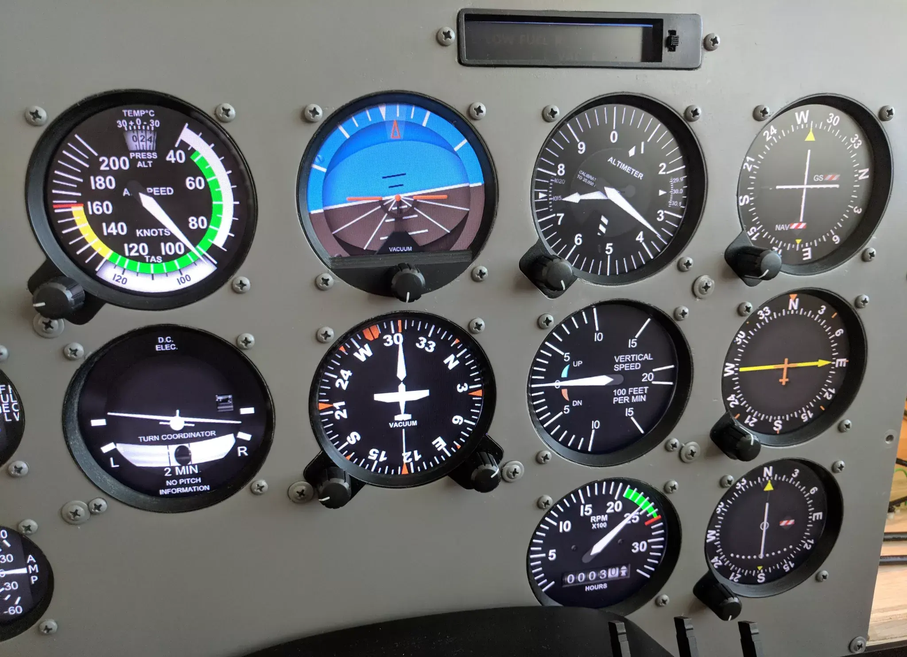

Upon inspecting the instrument panel of any aircraft, whether large or small, it may initially appear complex with its assortment of gauges, dials, knobs, and digital displays. However, familiarity with these instruments is crucial for pilots, as they provide essential information for safe and efficient flight operations.

In clear weather conditions under visual flight rules (VFR), pilots primarily rely on external visual references for navigation and orientation. However, during adverse weather conditions or when visibility is reduced, such as during instrument flight rules (IFR) conditions, pilots must depend solely on the information displayed on the instrument panel to maintain proper flight attitude and course.

## Examining the Instrument Panel

A comprehensive understanding of the instrument panel layout is vital for pilots. Let's examine the typical cockpit layout of a training aircraft, like the Cessna 172. The center column houses critical controls such as the fuel selector valve, elevator trim wheel, and manual power controls (throttle and mixture). Unlike driving a car, aircraft throttle control is manual, and ground steering is managed by foot pedals.

_Typical instrument panel in a Cessna 172_

The radio stack, situated at the center of the panel, contains communication (com) and navigation (nav) radios. Basic training aircraft typically have one of each, while IFR-equipped aircraft feature additional radios and navigational equipment.

Directly in front of the pilot are the primary flight instruments, including the altimeter, directional gyro (heading indicator), attitude indicator, vertical speed indicator (VSI), turn coordinator, and airspeed indicator. These instruments are essential for maintaining proper flight attitude and situational awareness.

Now, let's delve deeper into some key instruments:

1. Attitude Indicator: Also referred to as the artificial horizon, this instrument displays the aircraft's pitch and bank, simulating what would be visible through the windshield under clear weather conditions. It comprises a miniature airplane symbol within a horizon bar, providing a visual representation of the aircraft's orientation relative to the horizon.
2. Altimeter: Positioned to the right of the attitude indicator, the altimeter indicates the aircraft's altitude in feet above sea level. It functions similarly to a clock, with the large hand indicating hundreds of feet and the small hand denoting thousands of feet.
3. Vertical Speed Indicator (VSI): Located beneath the altimeter, the VSI provides information about the rate of climb or descent in feet per minute (fpm), aiding pilots in maintaining a steady vertical speed during ascent or descent maneuvers.
4. Directional Gyro (DG): Positioned to the left of the VSI, the DG, or heading indicator, displays the aircraft's current heading relative to magnetic north. It provides crucial information for maintaining the course and accurate navigation.

## Why Get an Instrument Rating?

Understanding the aircraft instrument panel is fundamental to pilot training, serving as a vital interface between the pilot and the aircraft. Mastery of these instruments enhances safety and efficiency in flight operations, contributing to a pilot's proficiency and confidence in the cockpit. Through dedicated practice and ongoing learning, pilots can develop a deep understanding of their aircraft's systems and instrumentation, enabling them to navigate through various flight conditions with precision and skill.

[Join us at Ideal Aviation](https://idealaviationstl.com/contact) at the St. Louis Downtown Airport (KCPS) to explore more about the aircraft instrument panel and enhance your pilot training experience!
