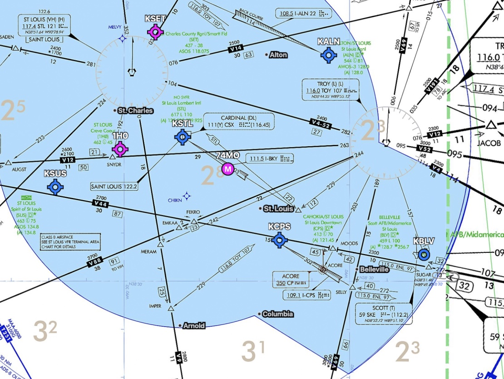
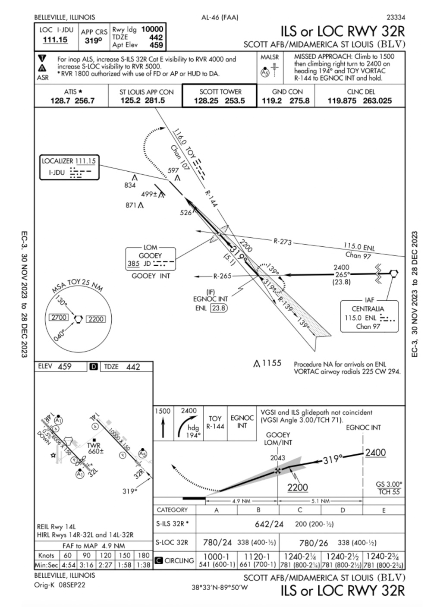
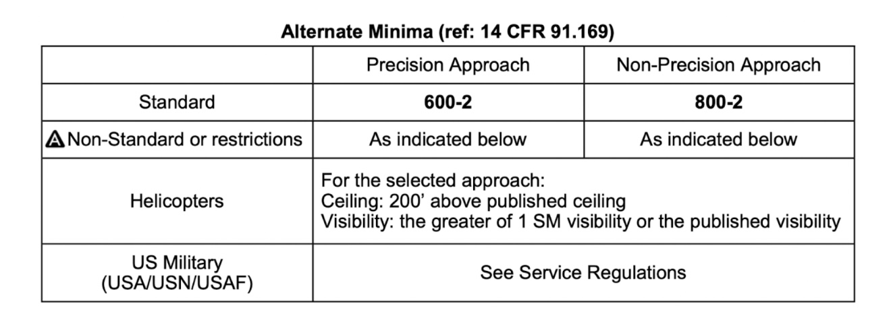
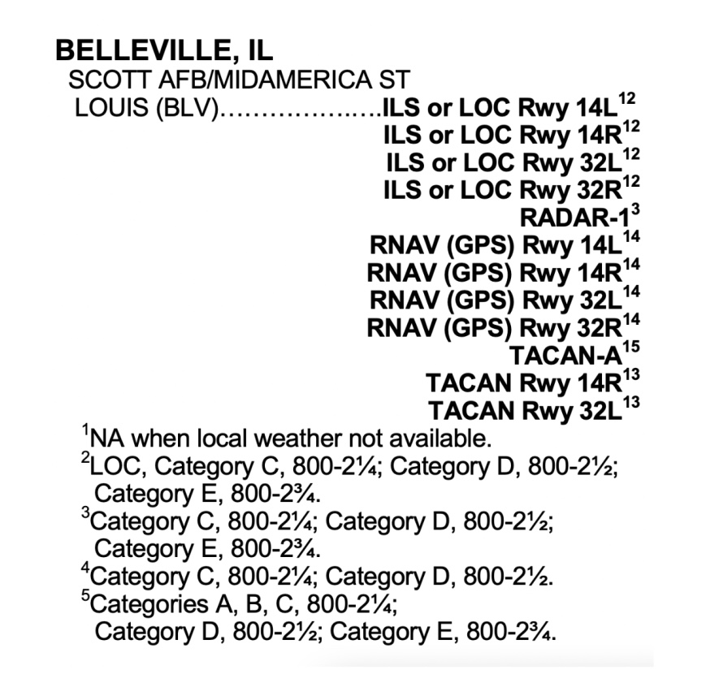

When starting instrument training, you'll encounter new rules and procedures. A common checkride question might be about planning a night IFR cross country trip to a destination airport with passengers. This question covers pilot requirements like instrument currency, night currency, and valid medical, as well as aircraft considerations such as airworthiness, registration, and required equipment.

Another question that comes up is, “Do you need an alternate?”

## What is an Alternate Airport?

An alternate airport is a backup in case your destination doesn't work out. For instance, if the weather deteriorates during your approach to the point you can't see the runway and go missed, did you plan for and file an alternate? (FAR 91.169)

### Alternate Airport Filing Requirements

Commonly known as the “1, 2, 3” rule, you need to file an alternate if the following conditions are met:

If the weather at the destination, for at least 1 hour before and 1 hour after the estimated time of arrival, is forecast to have at least a 2,000 foot ceiling (above the airport elevation) and visibility of at least 3 statute miles, you are not required to list an alternate airport in the IFR flight plan.

If either the ceiling or visibility is forecast to be less than 2,000 feet or 3 statute miles during that arrival window, you are required to file an alternate. Also, the destination airport must have at least one instrument approach procedure or an alternate airport will always be required.

The “ONE” is for 1 hour before and after.

The “TWO” is for a 2000 foot ceiling.

The “THREE” is for 3 mile visibility.

Even if these conditions are not met, it is still a good idea to be thinking about alternates when IFR (and VFR) flight planning.

### Cross Country to St. Louis Downtown Airport

You’re planning a trip from KSIK to KCPS. You just got some throwed rolls and some great food at Lambert's in Sikeston, and now you want to go home to St. Louis. The weather report is showing that there is some weather coming in. A 1000 foot ceiling and 1 mile visibility that is forecasted. Do you need to file an alternate? Do you choose to go or no go?

Some nearby airports include KBLV, KSUS, 1H0, KALN and KSTL. Factor in what approaches are available and also what the weather is looking like at the time of planning the flight. Make sure that the flight is within your personal minimums and you are current and proficient.

### Making Belleville an Alternate Airport

To keep going with the hypothetical example, let’s say we plan for the ILS 32R at KBLV as our alternate.

The minimums for the ILS is 642’ MSL 200 AGL and ½ visibility and with ceilings at 1000’ AGL and 1 mile visibility it looks like we can plan for this as an alternate. However just because the minimums are under the 1000’ ceiling doesn’t mean that we can use this as an alternate.

### Non-Standard Alternate Minimums at Belleville

The black triangle with an A signifies non standard alternate minimums. Your standard minimums would be 600-2 for a precision approach and 800-2 for a non precision approach (FAR 91.169)

However, there is a black triangle so we need to look at the alternate minimums which are found in the instrument approach procedure charts.

Under Belleville, IL (KBLV) for the non-standard approach minimums for the ILS 32R, 1 and a 2 are superscripted. In the footnotes, it says that for

1 - NA (not authorized) when local weather is not available and

2 - LOC category C and D have different minimums

Ensure that these minimums are met in your situation if choosing the ILS 32R at KBLV Belleville Scott Air Force Base / Midamerica St. Louis Airport.

## Fly Safe and Do Your Research

Flying is enjoyable, whether for a career or hobby, but safety is crucial. In instrument flying, understanding our limits and the set minimums is essential. Regulations exist for a reason – past aviators faced danger without them. Following procedures ensures our safety. Work with your flight instructor to fully understand regulations for both instrument and VFR flying. Enjoy flying, and prioritize safety.
